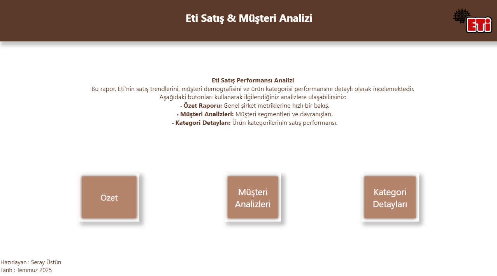
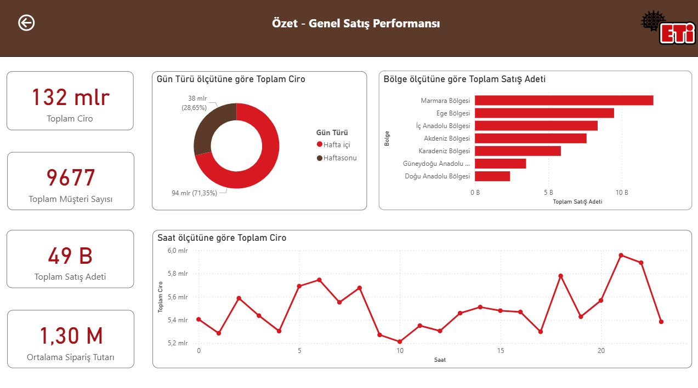
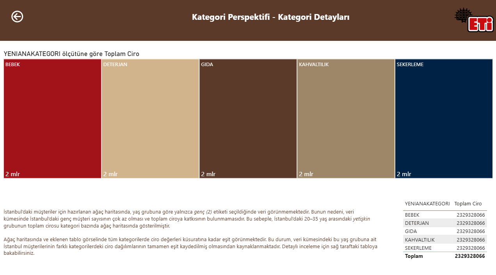

# Eti Markası İstanbul Müşteri ve Ciro Analizi

Bu proje, Eti markasının müşterileri üzerinde Power BI kullanılarak yapılan kapsamlı bir veri analizi raporudur.  

---

## Proje Kapsamı ve Amacı

Bu çalışma, **Kız Başına ve Patika iş birliği ile düzenlenen Veri Analistliği Bootcamp’i kapsamında tamamlanan 2. final projesidir**.  
Amaç, Eti markası müşterilerinin demografik ve satın alma davranışlarını analiz etmek, satış performansını değerlendirmek ve çeşitli perspektiflerden (müşteri, kategori, bölge) detaylı raporlamalar yapmaktır.

---

## Proje Sayfaları Ekran Görüntüleri

### Giriş  
  

### Özet  
  

### Müşteri Perspektifi  
  

### Kategori Perspektifi  
  

---

## Veri Kaynakları ve İşleme Adımları

Projede aşağıdaki veri tabloları kullanılmıştır:

- **Kullanıcılar (Users):**  
  - Doğum tarihi üzerinden yaş hesaplandı.  
  - Cinsiyet sütunu koşullu olarak oluşturuldu (E → ERKEK, K → KADIN).  
  - İsim ve soyisim ayrı sütunlara ayrıldı.  
  - Kullanılmayan sütunlar kaldırıldı/gizlendi.

- **Adres (Address):**  
  - USERID ve CITY sütunları birleştirildi.  
  - Veri tipleri kontrol edildi.

- **Ürünler (Items):**  
  - Kategori sütunları yeniden adlandırıldı.  
  - Yeni koşullu sütun `YENIANAKATEGORI` eklendi.

- **Sipariş Detay (OrderDetail) ve Sipariş (Orders):**  
  - Veri tipleri ve formatlar kontrol edildi, tarih sütunu çoğaltıldı.

- **Bölgeler:**  
  - Harici kaynaklardan (Python ile) şehir ve bölge bilgileri çekildi.  
  - Şehir sütunu büyük harfe dönüştürüldü ve model ile ilişkilendirildi.

---

## Modelleme

- Tablolar arasındaki ilişkiler uygun kolonlar ile kuruldu (ör. Kullanıcı ID’leri, Sipariş ID’leri, Ürün ID’leri).  
- Kullanıcıların görmeyeceği alanlar gizlendi.  

---

## Rapor Sayfaları ve İçerik

- **Giriş:** Proje açıklaması, veri seti ve amaçlar.  
- **Özet:**  
  - Haftasonu ve haftaiçi satış grafikleri.  
  - Bölgelere göre toplam satış adet grafiği.  
  - Saatlik satış tutarı grafiği.  
  - Önemli KPI kartları (toplam satış adeti, ciro, müşteri sayısı vb).  

- **Müşteri Perspektifi:**  
  - Tekil müşteri sayısı, kadın ve erkek müşteri sayıları kartlar.  
  - Bölgelere göre müşteri sayısı grafik.  
  - İstanbul’daki top 10 müşteri tablosu.  
  - Yaş grubuna göre satış grafiği.  

- **Kategori Perspektifi:**  
  - İstanbul’da genç grubundaki müşterilerin toplam cirosu kategori bazında ağaç haritası ile gösterildi.

---

## Önemli Notlar

- Eti markasında genç yaş grubuna ait müşteri kaydı bulunmamaktadır, bu nedenle bazı grafiklerde bu yaş grubu yer almamaktadır.  
- Ağaç haritasında tüm kategorilerde ciro değerleri eşit görünmektedir; bu, veri kümesindeki kayıtların eşit kaydedilmiş olmasından kaynaklanmaktadır.  
- Bazı kartlarda toplam müşteri sayısı ile kadın ve erkek müşteri sayılarının toplamı eşit çıkmayabilir; bunun nedeni veri setindeki eksik cinsiyet bilgileri olabilir.

---

## Dosya Hakkında

- Power BI raporu: `KızBaşınaFinal.pbix`  
- **Not:** Dosya 25 MB üzeri olduğu için GitHub üzerinde önizlenememektedir.  
- Raporu incelemek için `.pbix` dosyasını indirip [Power BI Desktop](https://powerbi.microsoft.com/) programında açmanız gerekmektedir.
- Power BI rapor dosyasını aşağıdaki bağlantıdan da indirebilirsiniz:  
  [Google Drive’dan indir](https://drive.google.com/file/d/1TXTLaGRTGEOfFxf2E9EWFMco6LDKgTPC/view?usp=sharing)  
---

